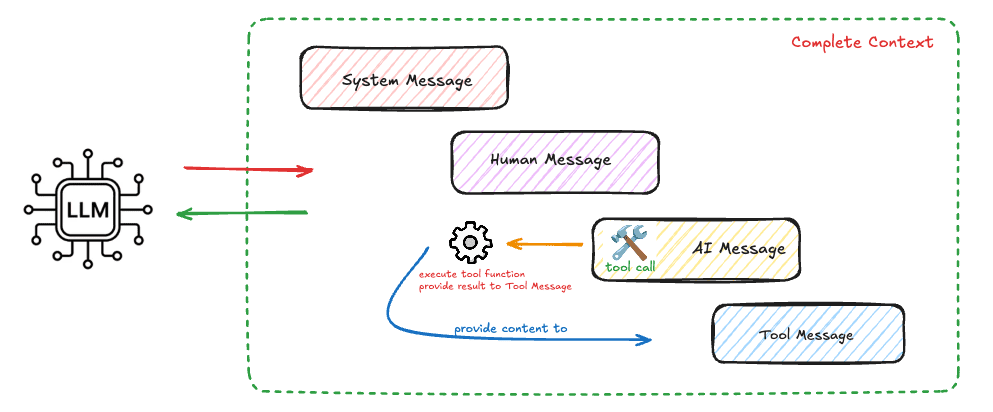

# Langchain Basics 

### 1. Creating LLM instance
First we install the required LLM model that you require. Langchain provides wide range of models you 
can select from. [link](https://docs.langchain.com/oss/python/integrations/chat/openai)
example : 
``
pip install langchain langchain-openai
``
```python
from langchain_openai import ChatOpenAI

llm = ChatOpenAI(
    model="gpt-4.1-mini",
    temperature=0
)
```
Notice that nothing has happened yet.We've only created an object representing our language model.

#### 1.1 Talking to the model
```python
from langchain_openai import ChatOpenAI

llm = ChatOpenAI(
model="gpt-4.1-mini",
temperature=0
)
response = llm.invoke(
"Explain Kafka in one sentence."
)
print(response.content)
```
Notice that ChatOpenAI is simply a wrapper around the OpenAI API.

#### 1.2 Understanding Parameters 
Model Behavior & Sampling

**Model** : Specifies the underlying LLM architecture to invoke.(ex - gpt-4o-mini,gpt-4o).

**Temperature** : Controls randomness. Higher values increase creativity; () makes the model deterministic, ideal for structured data and code generation.

**top_p** : An alternative to temperature called nucleus sampling. It limits the model's choices to a percentage pool of the most likely next tokens.

### 2. Messages

Messages are the fundamental unit of context for models in LangChain. They represent the input and output of models, carrying both the content and metadata needed to represent the state of a conversation when interacting with an LLM.

LangChain provides distinct message types—such as **SystemMessage**, **HumanMessage**, **AIMessage**, and **ToolMessage**—because underlying Large Language Models (LLMs) do not process raw text. Modern chat models are trained on structured JSON conversational roles (like system, user, assistant, and tool).

#### 2.1 Types of Messages In Langchain

1. **SystemMessage (The Core Guardrails)** 
   
   ***The Role***: Defines the model’s persona, permissions, operational scope, and output formatting rules.

   ***Why it matters***: It is injected at the very beginning of the context window. It acts as an authoritative constraint that the model references to prevent hallucinations and enforce security boundaries.

2. **HumanMessage (The Environmental Input)**

   ***The Role***: Represents the raw payload coming from the user or the external environment.

   ***Why it matters***: It isolates user instructions from system configurations, making it easier to structure prompts cleanly and mitigate basic prompt injection attempts.

3. **AIMessage (The Runtime Decision)**

   ***The Role***: Represents the output generated by the LLM. This could be standard text or a collection of structured tool invocation requests.

   ***Why it matters***: It holds the structural state of the model's logic. If an agent decides to use an external tool, the AIMessage captures the exact JSON parameters (tool_calls) the model wants to execute.

4. **ToolMessage (The Execution Feedback)**

   ***The Role***: Passes the results of an executed function or API back to the LLM.

   ***Why it matters***: LLMs cannot execute code natively. When a tool runs, its output must be fed back to the model wrapped in a ToolMessage linked to the original request ID so the model can read the results and formulate its next response.

#### 2.2 Dictitionary Format 
We can also make use the dictitionary format instead. You may be wondering why we have this dictitionary format
when we already have message types.The reason both formats exist comes down to Data Mutation vs. Data Storage.
- **At Runtime**, Objects give you safety and structure: If an LLM decides to call a database tool, it returns an AIMessage with a dedicated .tool_calls property. This property is fully parsed, typed, and structured by LangChain. Trying to find that nested payload manually inside a shifting, loose dictionary structure from OpenAI versus Anthropic Claude would result in brittle, bug-prone code.

- **For Storage**, Dictionaries offer longevity: If you save a native Python class structure into a database, your application will completely break if a future LangChain version renames or moves that class. Storing data as a standard dictionary ensures that your application history remains safe, readable, and transferable across different systems indefinitely.

#### 2.3 Tool Message and Tool Calls

For models that support tool calling, AI messages can contain tool calls. Tool messages are used to pass the results of a single tool execution back to the model. 
If you don't know tools as of now just remember it as extended functionality for the agents.

```python
from langchain.messages import AIMessage
from langchain.messages import ToolMessage

# After a model makes a tool call
# (Here, we demonstrate manually creating the messages for brevity)
ai_message = AIMessage(
    content=[],
    tool_calls=[{
        "name": "get_weather",
        "args": {"location": "San Francisco"},
        "id": "call_123"
    }]
)

# Execute tool and create result message
weather_result = "Sunny, 72°F"
tool_message = ToolMessage(
    content=weather_result,
    tool_call_id="call_123"  # Must match the call ID
)

# Continue conversation
messages = [
    HumanMessage("What's the weather in San Francisco?"),
    ai_message,  # Model's tool call
    tool_message,  # Tool execution result
]
response = model.invoke(messages)  # Model processes the result
```
One important thing to note is that an **AIMessage** may contain tool invocation details such as the **tool name**, **tool ID**, and **tool arguments**. After the tool executes, we pass its result back to the LLM using a **ToolMessage**, including both the tool's output and the associated metadata. This gives the LLM complete context about the tool execution, allowing it to reason accurately and generate a coherent final response.
<p align="center">
  
</p>

### 3. Tools

Tools extend what agents can do—letting them fetch real-time data, execute code, query external databases, and take actions in the world.
Under the hood, tools are callable functions with well-defined inputs and outputs that get passed to a chat model. The model decides when to invoke a tool based on the conversation context, and what input arguments to provide.

#### 3.1 Creating Tools 
The simplest way to create a tool is with the @tool decorator. By default, the function’s docstring becomes the tool’s description that helps the model understand when to use it:

```python
from langchain.tools import tool

@tool
def search_database(query: str, limit: int = 10) -> str:
    """Search the customer database for records matching the query.

    Args:
        query: Search terms to look for
        limit: Maximum number of results to return
    """
    return f"Found {limit} results for '{query}'"
```
We should provide proper tool description like what it does, what it takes like args and what it will 
produce in proper docs string or with the tool properties available with the tool decorator.

#### 3.2 Tools In Depth 
Since tools are the one that are interacting with our real systems, we need to pass user credentials, tokens,
database connection or other sensitive information to execute and perform, so How do we pass these sensitive information 
during the tool calls and preventing from the LLM itself.

